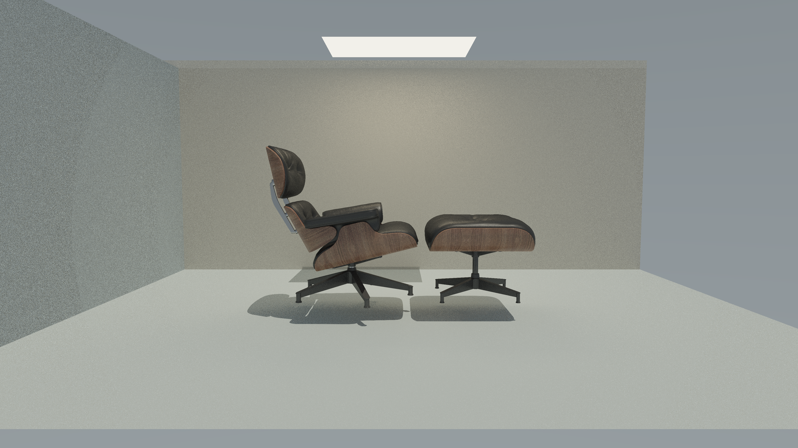

# Native 4K adaptive stable-pattern reference — 28 September 2026

Status: **captured and independently checked as visual reference material**.
Not a converged six-bounce accuracy reference, matched-quality performance result,
or production promotion. Tasks renderer#169 / lighting#87, Feature site#2114.
The corrected stable-pattern is retained as the experimental optimization path;
`renderer.sampling.stablePattern.enabled` and production defaults remain unchanged.

## Image and permitted description

Suggested factual caption:

> Native 4K adaptive path-traced Eames scene using corrected stable-pattern
> sampling, a six-bounce limit and 1–32 samples per pixel (5.95 average).
> Denoising is off. This is a development reference, not a real-time performance claim.

The PNG is the original 3840×2160 renderer output: no resizing, upscaling,
retouching, post-capture exposure adjustment or synthetic image generation.
Pixel-centre first camera samples and stable, pixel-decorrelated lighting use
the existing correction. Material transport is unchanged.

Visual inspection finds the chair, ottoman and original room intact, without
the old broad dark circular brightness bands. Low-SPP grain and changes in
noise density remain, especially on peripheral walls and floor. This capture
does not establish clean 1-SPP rendering or remove the remaining quality gates.
The model's publication licence/attribution was not found in the inspected
asset metadata; confirm the asset owner's terms before external promotion.
Nothing was published by this task.

## Exact capture contract

- Native 3840×2160; `maxDepth: 6` (ceiling, not six interactions for every path).
- Original Eames: 265468 source triangles, 265476 submitted scene triangles,
  137735 BVH nodes, five original 1024-square textures. No proxy geometry.
- Unchanged shared Product Studio camera, room and environment, rendered through
  the renderer fixture rather than the complete site application.
- Maximum/sequence period 32; centred circular budgets 32/16/8/4/2/1 SPP covering
  5/10/15/20/25/25% of pixels respectively. These are prescribed diagnostic tiers,
  not evidence that the conservative production importance classifier is qualified.
- Denoise, temporal radiance reuse, resolution scaling, motion/frame-budget
  reduction and fused scheduling are off. Telemetry and profiling are on.
- Exact requested and completed camera samples: **49351680**, mean **5.95 SPP**.
  Each of the 510 tiles and every tier histogram matches its budget.
- Secondary rays **70755626**; total path segments **120107306**.
  Per-depth counts: 49351680, 44622538, 19508225, 5014768, 1259133, 350962.
- Seeds 7 and 19 produced bit-identical full linear HDR and equal ray histograms.
- Physical non-fallback Apple/Metal-3 adapter. This receipt does not independently
  identify the exact Apple chip model. Browser user agent is in the raw receipt.
- 8704 CPU/GPU sampler comparison words passed. No successful-run validation
  error, failed sample count, timeout or device loss was observed.
  Resource-owner cleanup check passed. This is not exhaustive queue-capacity or
  device-stability qualification across scenes.

## Performance and memory boundaries

These are diagnostic captures, not timing-only benchmark rounds. Readback-inclusive
elapsed times are 24446.30 and 24796.70 ms; summed per-tile GPU spans are 20737.29
and 21257.52 ms. Do not quote these as qualified frame latency, 60 Hz performance,
or a before/after speedup. A warmed, paired timing protocol remains required.

Application-visible inventory: renderer buffers 192581020 bytes, adaptive buffers
34304284, telemetry 12352, fixture staging 589824, and logical texture payloads
225043336. Total inventoried GPU allocations: 452530816 bytes (about 431.57 MiB).
Host cached budgets are separately 74649600 bytes. Full HDR readback is separately
132710400 bytes on the host, with additional capture/encoding/browser overhead.
These inventories are not exact physical VRAM residency or peak total process memory.
No memory-reduction claim follows from fewer samples.

## Provenance and retained artifacts

Capture ID: `native-stable-reference-2026-09-28T08-17-55-720Z-0427b890-f26f-437a-937b-27aea1343b71`.
The replay served immutable Git objects:

- Renderer [69c36d75a546c25ec998face4dd84eaa7f014aef](https://github.com/Plasius-LTD/gpu-renderer/tree/69c36d75a546c25ec998face4dd84eaa7f014aef).
- Lighting [3166c396dcda08ea0848cabd45f2583449ebcbbf](https://github.com/Plasius-LTD/gpu-lighting/tree/3166c396dcda08ea0848cabd45f2583449ebcbbf).
- Shared `729f89c7f77fcadb9ee7eeca53fb6daf02865b8e`.
- Site/assets `21d43a9b63722f1ce69175a5a42b53304ee79102`.

Committed artifacts:

- [Clean native PNG](eames-4k-adaptive-stable-6-bounces-2026-09-28.png), 15955723 bytes,
  SHA-256 `16b11f23803e5c7abd4fc6678fa8b70aaa756467817a74bbc51d2c8f9e43afee`.
- [Raw capture and repeat receipt](stable-reference-4k-2026-09-28-receipt.json).
- [Independent verification](stable-reference-4k-2026-09-28-verification.json).

Full linear HDR was reconstructed from all 32 locally retained compressed byte-plane
chunks. Every chunk offset, length and hash, the final image hash, finite values,
native PNG dimensions, actual counts, raw timestamp spans and all seven original
asset hashes were checked. HDR SHA-256:
`00e96af3f4dc662b35ceb292d1796ef6549a0441dff6cf3878274dc793bd777c`.
Raw chunks remain under `output/playwright/eames-environments/<capture ID>` in the
workspace; they are not included in this Git image/receipt delivery. Independent
HDR re-analysis outside this machine requires separately transferring those chunks.

The deliberately stopped UI run
`native-stable-reference-2026-09-28T08-17-26-503Z-eaba6bbe-d3ee-4742-8572-b004e545e5e8`
is retained locally and excluded. Its generic cancellation/device-loss message
was caused by the Stop control. Restart succeeded; overlapping Run was disabled.
The completed image and save link were visible. The subsequent browser download
check could not complete because the browser connection became unavailable;
the native file above was already retained and its hash verified independently.

## Validation and remaining work

Requirements-first negative tests cover explicit/default/mismatched depth,
invalid depth, native dimensions, sampler/mode and actual budget evidence.
Package tests/coverage, lint, type checks, build, package checks, runtime dependency
audit and full touched-package Zero-Three checks passed. Changed lighting source
is present in LCOV at 100% line coverage; renderer transport source is unchanged.
Source CI passed for [renderer](https://github.com/Plasius-LTD/gpu-renderer/actions/runs/36396125536)
and [lighting](https://github.com/Plasius-LTD/gpu-lighting/actions/runs/36396199342).

This adds an explicit six-bounce admission without changing the existing four-bounce
benchmark. Follow-up work includes local/silhouette/converged quality, moving-scene
and focus behavior, sustained matched-quality performance, full GPU-tab integration
and release gates. The broad Tasks and Feature remain In Progress. No merge,
package release, white-paper improvement claim or production enablement occurred.
